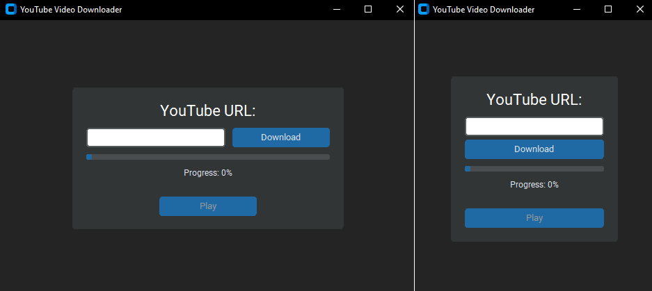

# PYTHON__002__TubeDownloaderGUI

## Project Overview 
- **name**: TubeDownloaderGUI
- **type**: GUI (Graphical User Interface) app

## Preview



## Description 
- A Python application that downloads YouTube videos using the pytubefix module and plays them using an external video player.
- The GUI is built with the customtkinter module for a modern and user-friendly interface.

## Benefits
- Simple and intuitive interface that lets you play the video immediately after downloading—no need to search for it manually.
- Eliminates the need to rely on third-party websites for downloading YouTube videos.
- Cross-platform support: works on Windows, macOS, and Linux.

## Tools & Techniques Used
- **Language**: Python (3.12.1)
- **Modules**:
    - ***customtkinter*** [modern GUI widgets and buttons]
    - ***tkinter*** [basic window and layout management - in this case used only for messagebox dialogs]
    - ***pytubefix*** [downloading YouTube videos]
    - ***threading*** [run download process in the background]
    - ***os*** [file paths and directory handling]
    - ***subprocess*** [open video in external video player]
    - ***platform*** [detect the operating system]
- **Built-in Functions**
    - ***range()*** 
- **Built-in/Custom Types**
    - ***number*** [```percent = downloaded / total_size```]
    - ***class*** [```class YouTubeDownloaderApp:```]
    - ***def (functions)*** [```def start_download(self):```]
    - ***sequence (range)*** [```for i in range(6):```]
- **Error Handling**
    - ***try ... except ... finally + raise***
    - ***Exception (class)***
- **Responsiveness**
    - ***<Configure> event binding + custom "on_resize" function*** [detects window resize and updates layout accordingly]
- **GUI**
    - ***messagebox*** [tkinter]
    - ***CTkFrame*** [customtkinter]
    - ***CTkLabel*** [customtkinter]
    - ***CTkFont*** [customtkinter]
    - ***CTkEntry*** [customtkinter]
    - ***CTkButton*** [customtkinter]
    - ***CTkProgressBar*** [customtkinter]
  
## Running Locally
1. Clone the repository

   ```bash
   git clone https://github.com/MiloosN5/PYTHON__002__TubeDownloaderGUI.git
   cd PYTHON__002__TubeDownloaderGUI
   
2. Set Up a Virtual Environment (Optional)
    ```bash
        python -m venv venv
        venv\Scripts\activate # on Windows
    ```
3. Install Dependencies

   Before installing dependencies, make sure your virtual environment is activated (see step 2 from above)!
    ```bash
        pip install -r requirements.txt
    ```
4. Run the Application
    ```
        python main.py
    ```
5. Find the desired YouTube video and copy its URL.
6. Paste the URL into the input field in the GUI application.
7. After the download is complete, play the video using the Play button.
8. Enjoy! 😊

***Additional:***

9. Update requirements.txt When You Add New Packages

    Whenever you install a new package (e.g. with pip install package-name), make sure to refresh your requirements.txt.

    Run this command to update the file:
    ```bash
        pip freeze > requirements.txt
    ```
